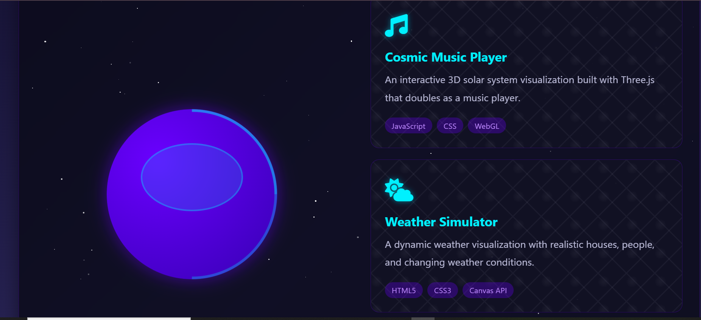

# Space Explorer Portfolio

A cosmic-themed portfolio website with animated elements and interactive project cards. This project showcases a unique space explorer theme with a floating helmet, twinkling stars, and responsive design.

## Features

- **Animated Cosmic Helmet**: Floating 3D helmet with glass effect
- **Twinkling Star Background**: Dynamic starfield with random twinkling
- **Interactive Project Cards**: Hover effects and animations
- **Responsive Design**: Adapts to mobile and desktop screens
- **Project Statistics**: Visually appealing facts section
- **Modern UI**: Glassmorphism and gradient effects

## Technologies Used

- HTML5
- CSS3 (with animations and gradients)
- JavaScript (for starfield generation)
- Font Awesome Icons
- Google Fonts (Orbitron)

## Project Structure
